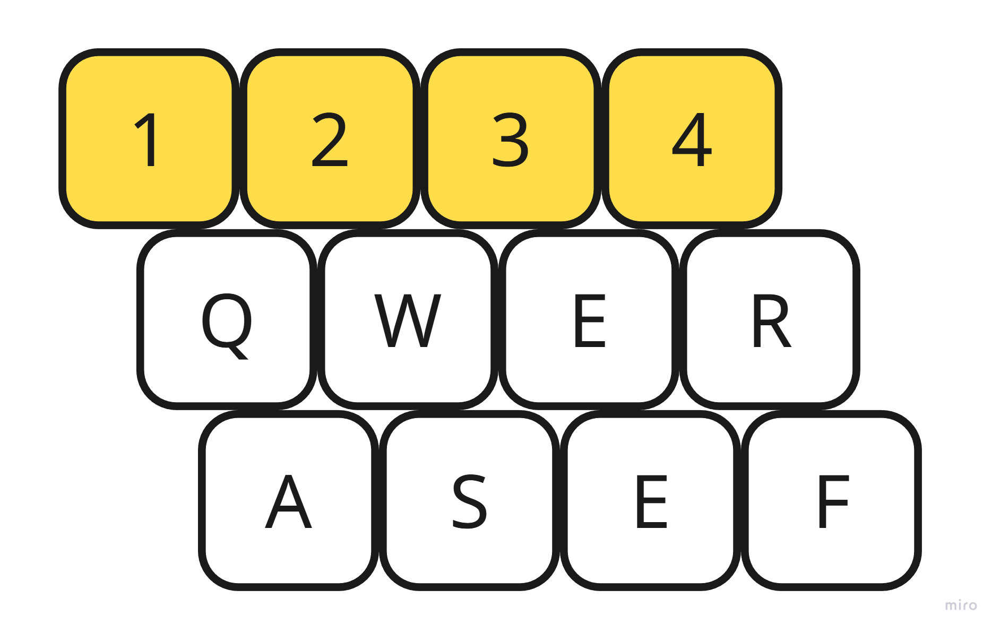

Fieldpen is a pixel/voxel art creation and sharing platform. It stands out from other online platforms for the following reasons:

- Pixel AND voxel art are both supported
- Emphasis on animation and export to game engines
    - *Not* simply an art-sharing platform
    - Animation often an after-though with a frame selector, “play” button; this is missing tons of animation features like ghosting, cel layers, camera controls for video rendering, etc.
- Online marketplace to sell hand-made art assets
- Innovative UI meant to address cognitive overload of feature-bloated editors (i.e. toolbelts, more on that below)
- And most importantly, ***it’s a platform***
    - Plugins/extensions for drawing, animation, rendering, asset management, whatever else people think of
    - Fieldpen exposes tons of *events* and *resources* that give extensions access to the user’s project

# High-Level Design

The core of a Fieldpen project is an **asset**. Assets can be pixel assets, voxel assets, image assets, composite assets, animation assets, etc. Each asset type has an asset editor associated with it. Artists work on their assets using **tools** in their **toolbelt.** Toolbelts are a key UX abstraction that give artists full customizability of their workflow without overcomplicating things.

### Tenets

- Every artist works different; Fieldpen maximizes customizability.
- Integrations into your ecosystem should be seamless; Fieldpen is designed for building *asset pipelines*, not just standalone downloadable assets.
- Fieldpen is an online tool—it’s optimized for collaboration among teams and sharing with the public.

### Asset Editors

**Pixel.** An infinite-plane 2D pixel asset editor. Objects in the pixel editor are essentially PNGs with transforms.

**Voxel.** An infinite-space 3D voxel asset editor.

More TBD.

### The Toolbelt

The toolbelt is the most important piece of UI for artists, except maybe for the main canvas that renders their art. The toolbelt is inspired by action-RPG, RTS, and other games where customizable hotkeys are crucial for a responsive game experience. The default toolbelt layout is optimized for 4-finger movements on the Q-R and A-F keys, and it by default appears in the bottom-left of the workspace. Toolbelts themselves are assignable to the number keys.

**Customizability.** Fieldpen has a vast, publicly-extensible library of tools for each editor. Editors expose events and resources that allow new tools to be added to the toolkit for the editor. For the most common access, tools are assigned to slots in the toolbelt.

**Toolkits.** Tools are bundled into toolkits. Each editor comes with a standard toolkit (or set of toolkits) with tools for basic editing features.

**Tab.** There will be a large variety of tools in toolkits available for each editor. Many toolbelts will be constructed from these tools. Tab opens a search + browse panel for building toolbelts, assigning them to toolbelt slots, browsing toolkits and tools, etc. etc. It also gives simple text search → hit enter to select a tool directly from the library of tools for ad-hoc use.

💡Pro-tip! Don’t keep too many tools on your tool belt. It will (cognitively) weigh you down. Break down your work into smaller tasks, then equip the appropriate toolbelt for the task at hand.

**Tilde.** Toolbelt documentation is shown/hidden by pressing the `~` key. By default it’s displayed in a list along the left-hand side of the screen.

**Left-hand stability.** The ideal pixel or voxel artists workflow keeps their left hand on the keyboard and their right hand on the mouse. Ideally, the mouse never leaves the editor canvas—it is the artist’s brush and should rarely be used for navigating menus, selecting tools, and other tasks that are not directly creating art.